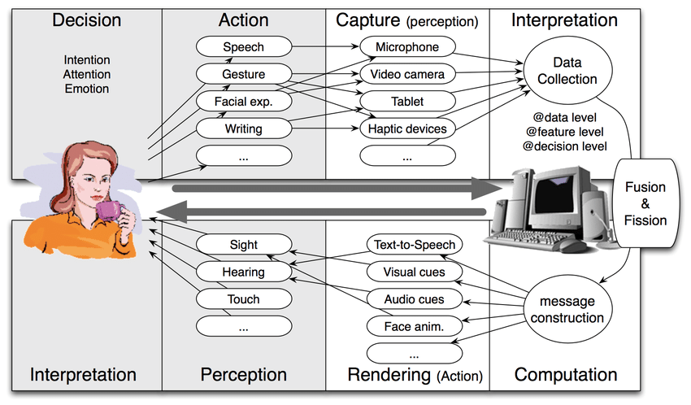
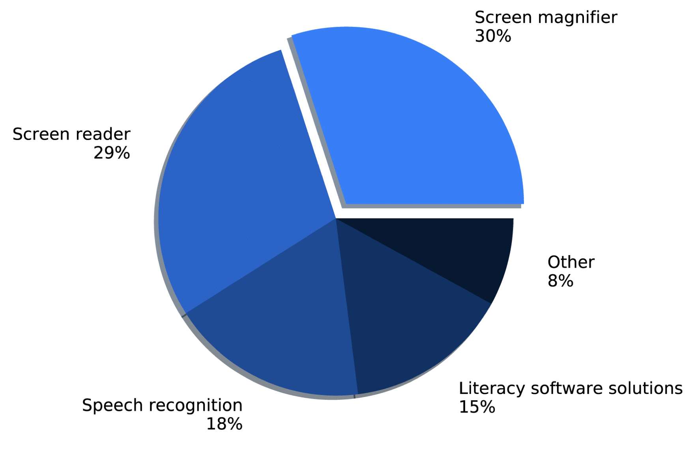
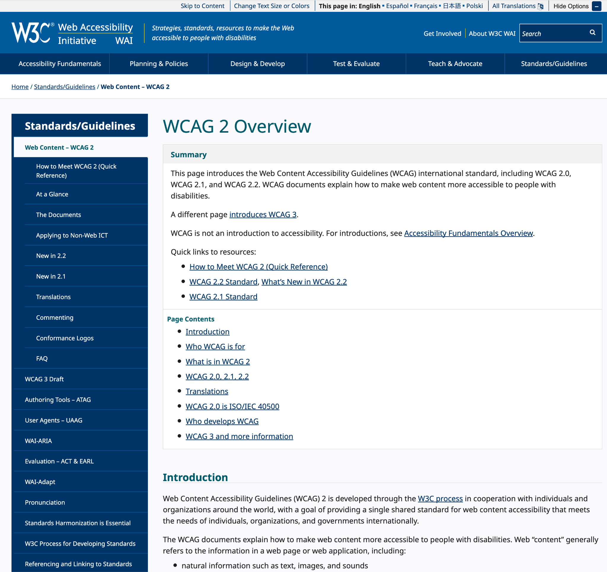
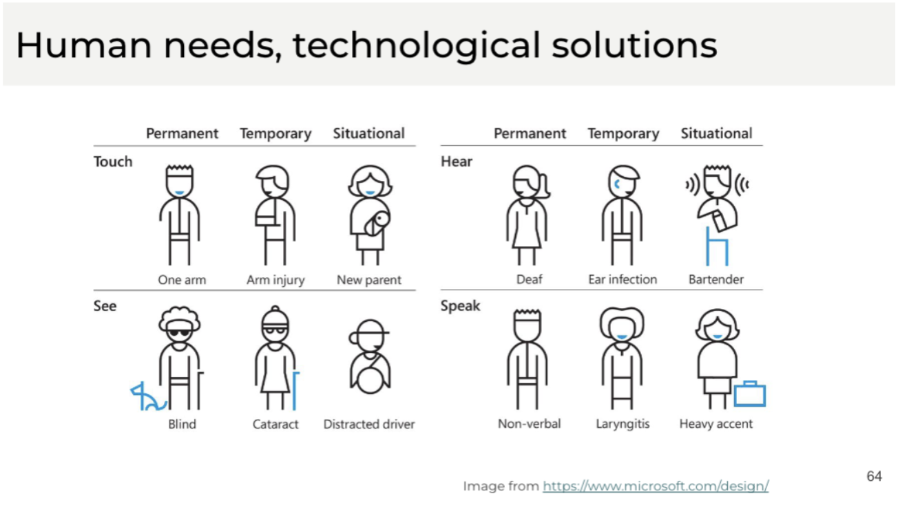
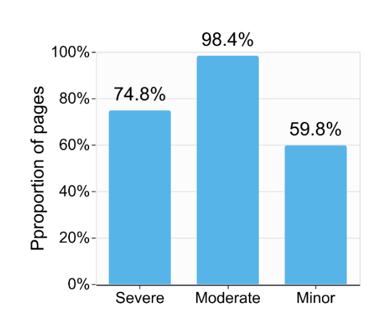

This session covers the background in accessibility and its importance in the field of computational biology.

## What is Accessibility?

> “Accessibility is the design of products, devices, services, vehicles, or environments so as to be usable by people with disabilities.”
> 
> Henry et al. 2014

## Population of Disability

* 26% of the US population reported to have more than one disability.
* Among them 13.7% reported having mobility disability and 10.8% having cognitive disability
* Worldwide, 29% has visual disability or colorblindness.

## How the Computer Sees Us

The computer system largely depends on a few input and output channels of human, including vision, touch, and sound, making barriers for people with disabilities.

<figure>
    
</figure>

## Multimodal User Interactions

Common approach to address accessibility issues are supporting multimodal user interactinos, offering multiple input and output channels of human to users.

<figure>
    
</figure>

### Typical Approach

The most common approach would be providing a more robust representation, such as text, for a less robust representation, such as images.

## What Are Accessibility Technologies?

<figure>
    
</figure>

## Accessibility Standards

* [Web Content Accessibility Guidelines (WCAG)](https://www.w3.org/WAI/standards-guidelines/wcag/)
* WCAG 2.2 (released in Oct. 2023)

<figure>
    
</figure>

### The POUR Principles
The WCAG guidelines are structured based on four important categories.

* Perceivable
* Operable
* Understandable
* Robust

## Why Should We Care?

* Our shared goal as computational biologists is to make our data and tools widely usable and accessible
* There is a notable discrepency between the US population and US genomic workforce of people with disabilities: 26% vs. 3%.

### Accessibility is Good for Everyone

We all encounter situations in our lives where we become disabled.

## Accessibility is Good for Comp. Bio.

There are several examples where accessibility help our research more impactful.

1. Accessibility increases AI usability
    * AI agents and LLMs can better understand/interact with your websites, tools, documentations if they follow accessibility guidelines
2. Accessibility helps making your research reproducible
    * "[R]eproducibility [of Jupyter Notebooks for biomedicine] could likely be improved considerably if the code—and dependencies in particular—were better documented." ([Samuel and Mietchen, 2024](https://academic.oup.com/gigascience/article/doi/10.1093/gigascience/giad113/7516267))

## How is the Accessibility State in Comp. Bio.?

Our evaluation results showed that the majority of data portals (74.8% of 3,112) have severe accessibility issues ([inscidar.org/](https://inscidar.org/)).

<figure>
    
    <figcaption><b>Caption.</b> An accessibility evaluation result shows that more than 70% of 3,112 data portals we analyzed have severe accessibility issues.</figcaption>
</figure>

## What Can We Do To Make It Better?

We will cover four topics in our tutorial to make biological data resources and visualizations more accessible.

* Writing alt-text for biological data visualization
* Keyboard accessibility of biological resources
* Designing accessible biological visualization
* Making computational notebooks accessible

