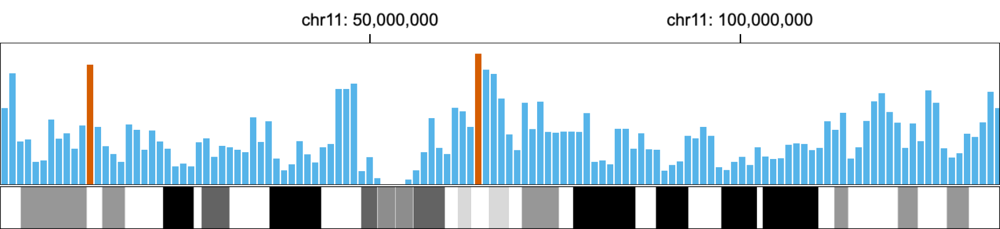

## Overview

* You will learn accessibility guidelines for biological visualizations.
* These guidelines are based on Chartability ([Elavsky et al.](https://www.frank.computer/chartability/)).
* (Activity) You will evaluate two biological data visualizations using the guidelines.

## [Chartability](https://chartability.fizz.studio/)	
* A set of heuristics for ensuring the accessibility of data visualizations and interfaces
* Helpful for both accessibility experts and novices
* We mainly use “critical” heuristics

## “Critical” Checklist
* Low contrast
* Small text size
* No explanation for purpose or for how to read
* No title, summary, or caption
* Data density is inappropriate

## Color
* Must have a contrast ratio of at least 4.5:1 ([Contrast Checker](https://webaim.org/resources/contrastchecker/))
* Use colorblindness-friendly palette (e.g., [okabe-ito](https://thenode.biologists.com/data-visualization-with-flying-colors/research/))
* Human cannot easily differentiate more than 10 colors
    * If necessary, group and filter categories
* Avoid using colors only
    * Different shapes of mark
    * Bar charts with different textures

## Textual Descriptions
* Title, summary, or caption
* Axis labels
* Legend labels

## “Critical” Checklist for Interactive Charts
* Interaction modality only has one input type
* No interaction cues or instructions
* No data table or spreadsheet
* Navigation and interaction is tedious

## Activity (15 mins)
Evaluate the accessibility of two biological visualizations using Google Form ([Link](https://forms.gle/iRDDFXqMLqUrTZrv8)).

* [Spitzer et al. (Nature Genetics 2025)](https://www.nature.com/articles/s41588-025-02168-4)

* [Corces et al. (Nature Genetics 2020)](https://www.nature.com/articles/s41588-020-00721-x)

## Choosing Chart Types
There are many different chart types that you can choose (e.g., 66 chart types in [datavizcatalogue](https://datavizcatalogue.com).

## We Love Circos, But Is It Most Effective?

## Circular vs. Linear Layouts
This examples shows a limitation of circular layouts when perceiving the difference of bars that are positioned in distant.

## Sequence Logos

The use of inaccessible colors and distorting the height of letters in Sequence Logos is not accessible and effective visual encoding for human perception.

## Alternative Sequence Logos
* Maguire et al. 2014

* Marek et al. 2014

## Visualization Guidelines
* VisGuides ([visguides.org](https://visguides.org)) is a resource and an open community for visualization guidelines.

