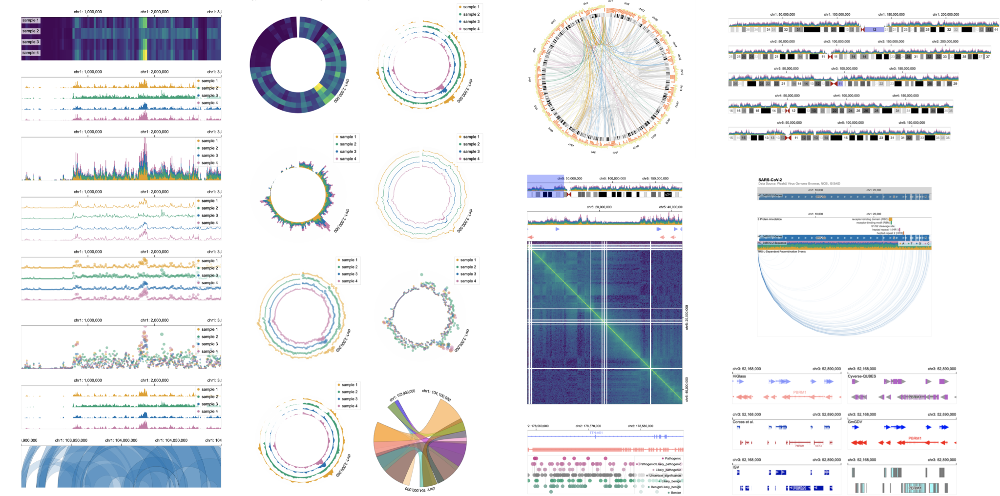
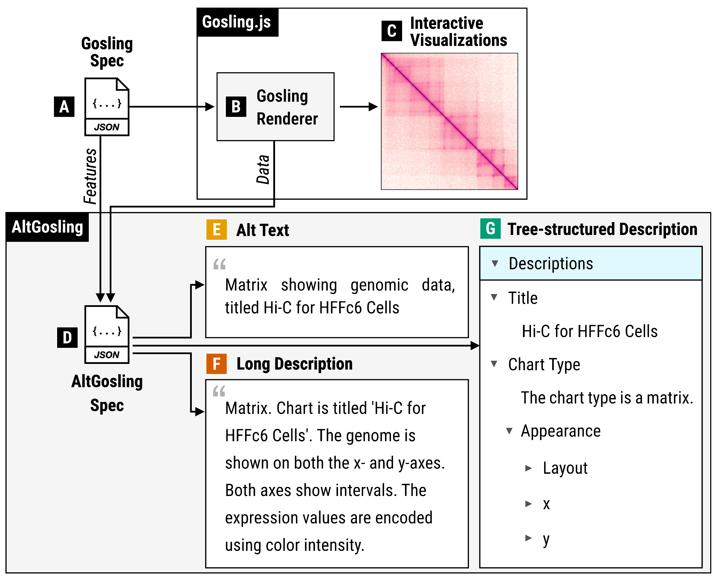
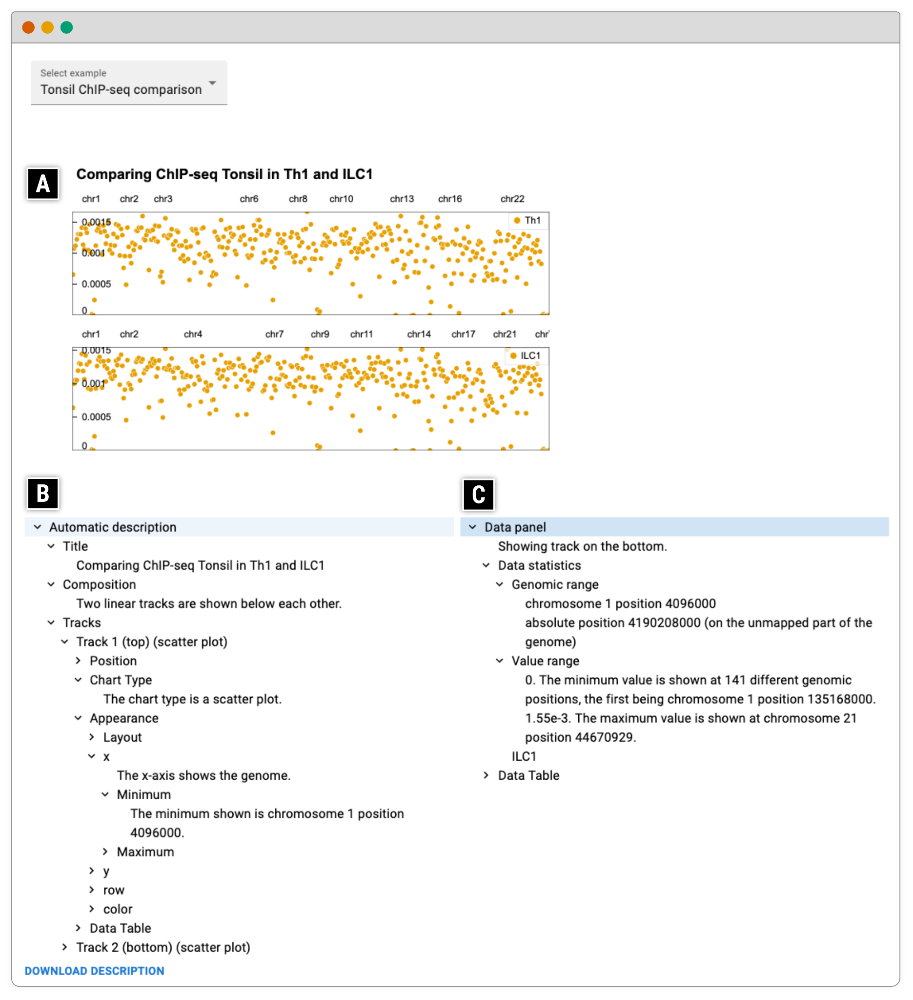
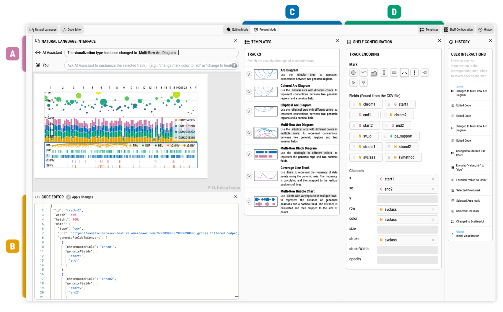

Here, we list a few open problems and our solutions in the space of accessibility of biological data. 
 
## Accessibility of Genomic Visualization

* Challenges
    * Variety of visualization designs (e.g., Circos, Sequence Logos)
    * Many visualizations at once (8.1 tracks on average)
    * User interactions (e.g., zoom and pan)

## AltGosling ([Demo](https://gosling-lang.github.io/altgosling/), [Paper](https://academic.oup.com/bioinformatics/article/40/12/btae670/7900296))

Automatic generation of text descriptions for accessible genomics data visualization

## Blace ([Paper](https://ieeexplore.ieee.org/document/10670517))

LLM-based Multimodal Visualization Authoring

## Accessibility of Data Portals

In our study, only 55.3% were successful for a screen reader to perform common tasks in data portals ([inscidar.org](https://inscidar.org)).

## INSCIDAR Project

You can visit our project website ([inscidar.org](https://inscidar.org)) to see our evaluation results and visualizations. We will run accessibility evaluation annually and release the results in this website.
